# A centralized team in a decentralized world:
## *Engineering tools at Netflix*

##### Mike McGarr   [@SonOfGarr](http://twitter.com/SonOfGarr)

---

^ when I was a kid, I was obsessed with fighter jets…
image attribution: http://bit.ly/1dXNQ6h

---

^ my favorite was the F-14 Tomcat...
image attribution: http://bit.ly/1HfEpeB

---

^ How does a plane fly?
There are four forces (https://www.grc.nasa.gov/www/k-12/airplane/forces.html)
image attribution: http://bit.ly/1Ezfwol

---

^ engines provide thrust

---

^ drag impacted by shape, air stickiness and velocity of aircraft

---

^ gravity+mass provides weight

---

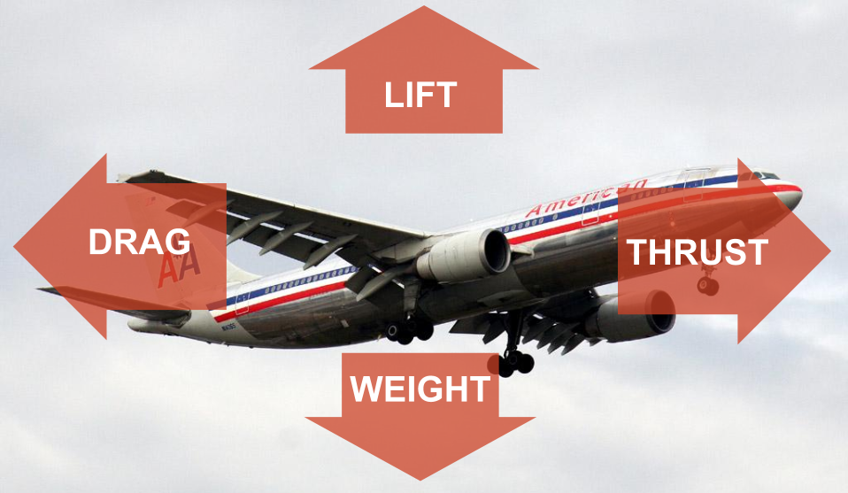

^ lift impacted by shape, size and velocity of aircraft

---

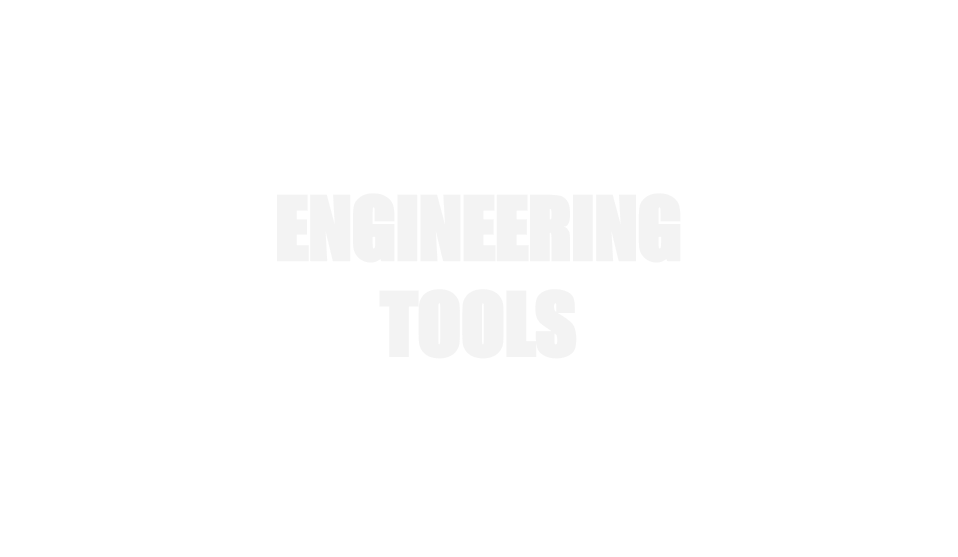

---

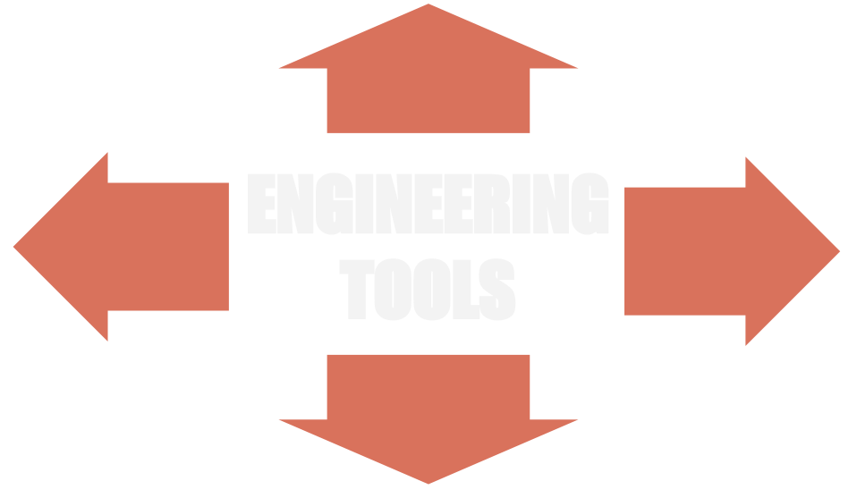

---

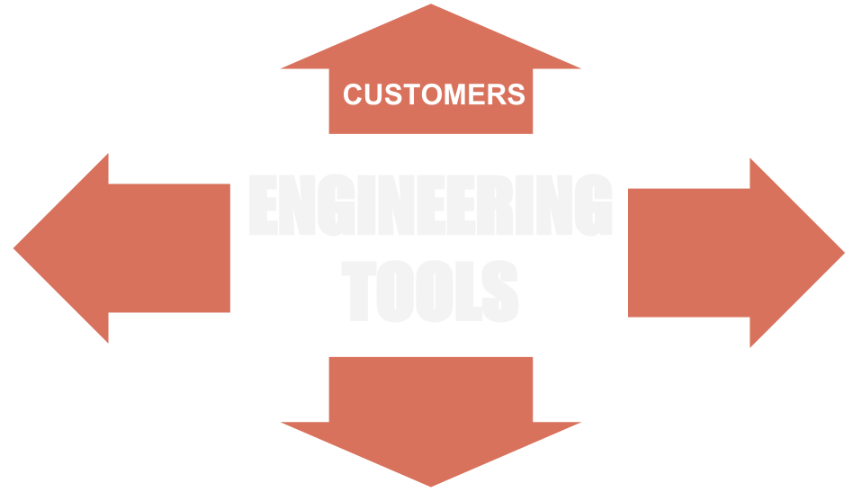

---

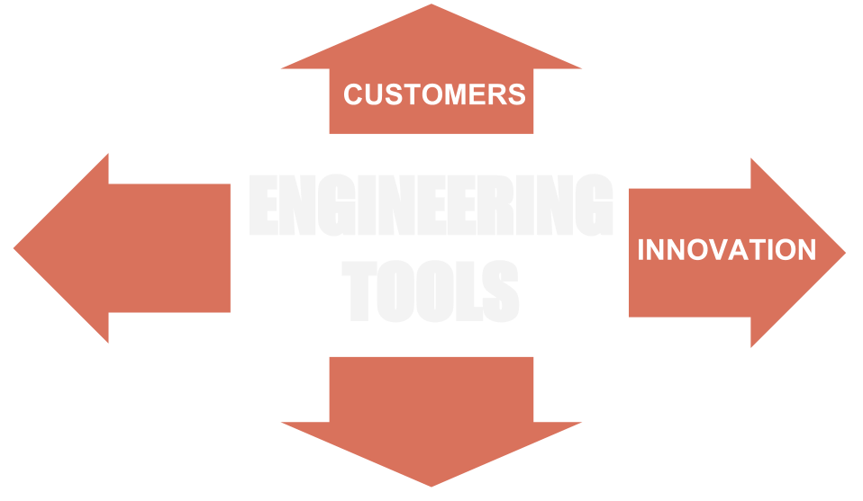

---

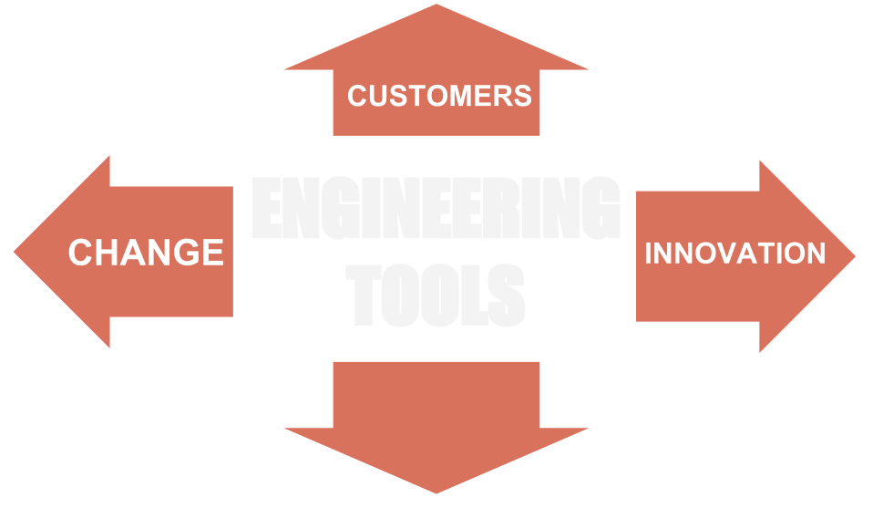

---

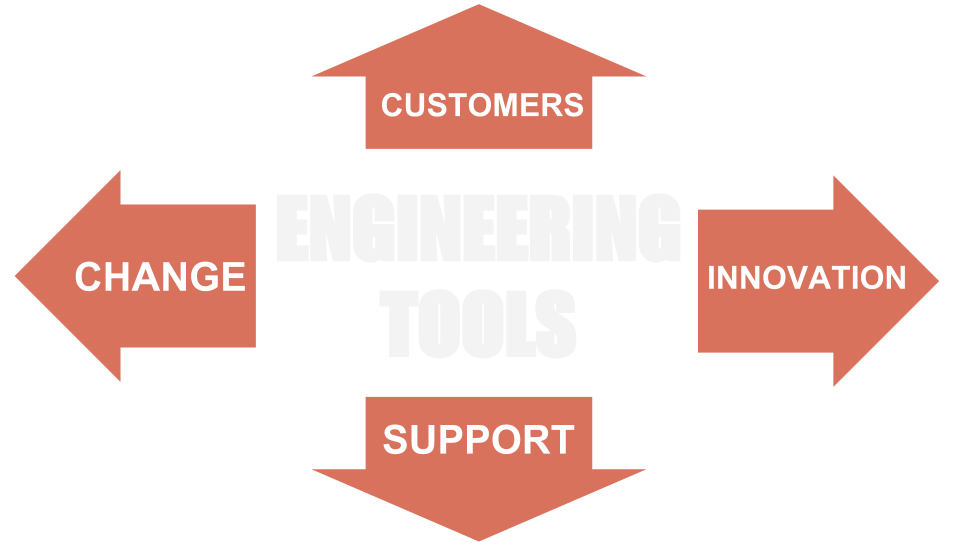

---

## increase the # of 
# [fit] *delighted customers* 
## while decreasing 
# [fit] *support waste*

^ More customers == more support costs

---

## increase rate of 
# [fit] *innovation* 
## while decreasing the
# [fit] *impact of change*

^ More Innovation == more change

---

# [fit] Customers

---

# our customers are *engineers*

---

# freedom & responsibility

^ freedom & responsibility
senior engineers
high performance culture
context not control

---

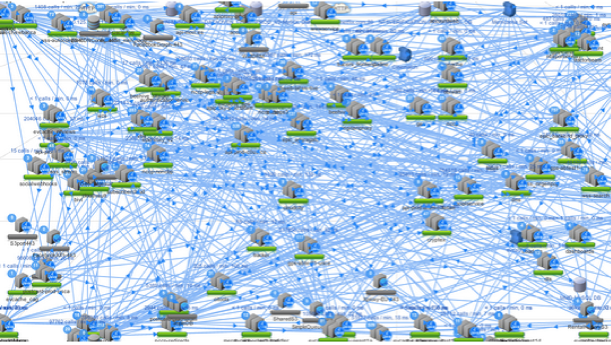

## microservices

---

# *sub*cultures

---

# free market

^ Engtools must provide tools/services that customers want/need
they have the right to go elsewhere
image attribution: http://bit.ly/1KiFMcq

---

# we build *products*

^ we don't own builds, or manage releases
image attribution: http://bit.ly/ZfZFxv

---

# the Paved Road

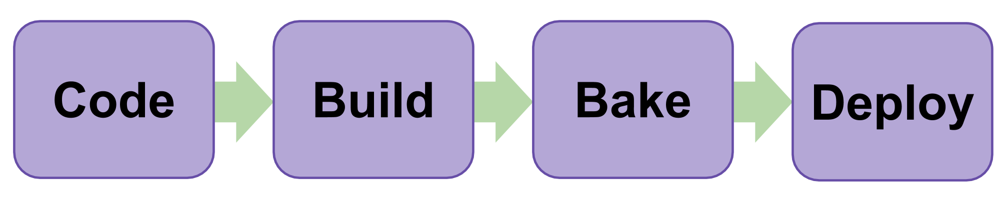

--- 

# [fit] one *paved road*
## does not *fit* all

---

# *opaque* paved road

---

# *composite* paved road

---

# visualize *spectrum* of customers

---

# be your own customer

^ image attribution: http://bit.ly/1BSOIye

---

# [fit] Support

---

# supporting the paved road

- support emails
- hipchat questions
- walk-bys
- meetings
- bug reports
- feature requests

---

# maker's schedule

> For someone on the *maker's schedule*, having a meeting is like throwing an exception. It doesn't merely cause you to switch from one task to another; it changes the mode in which you work.[^1]
-- Paul Graham

[^1]: http://www.paulgraham.com/makersschedule.html

---

# first responder

^ image attribution: http://bit.ly/1G7XPAM

---

# ticketing system

---

## optimize 
## [fit] *communication* 
## channels for **customers**

^ image attribution: http://bit.ly/1HdJAGA

---

# community support

---

# chatops
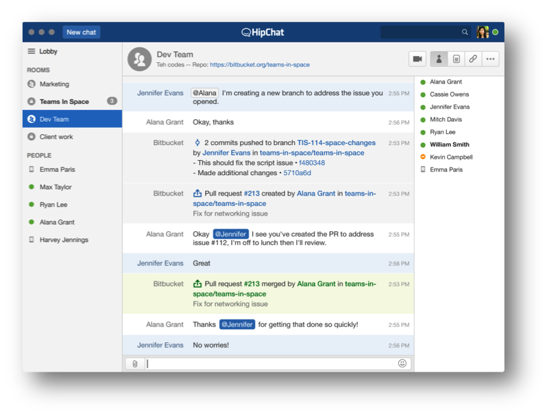

---

# Q & A

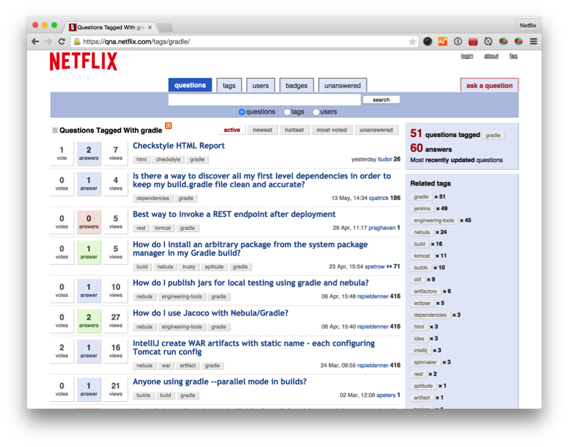

---

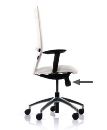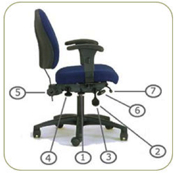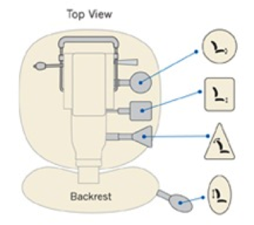
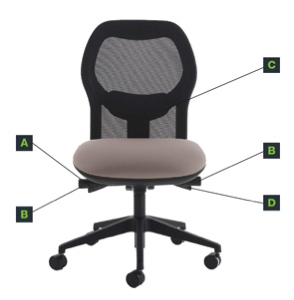

---

# don't underestimate *usability*

---

# [fit] Innovation

---

# tool stagnation

- tools don't evolve
- customers want new features
- "it works, why change it"
- lacks organization alignment

---

---

# *distribute* innovation

---

---

# *institutionalize* innovation

---

> "...hiring managers should *staff beyond the bandwidth needed* for known tasks.
-- Daniel Jacobson, Netflix

^ "...hiring managers should *staff beyond the bandwidth needed* for known tasks. This will give the team the ability to swell and contract its focus on  such work while continually maintaining a reasonable amount of time towards *introspection* and *innovation*.

---

# hire beyond your needs

---

# make space for *innovation*

---

# [fit] Change

---

# 2014 migrations

- Perforce to git
- Java 6 to Java 7
- Shard Jenkins
- Evacuate the data center

---

# so we're done...*right*?

---

# 2015 migrations

- Ant to Gradle
- CentOS/Precise to Trusty
- Asgard to Spinnaker
- Tomcat 6 to 7 (or is it 8, or 9?)
- Java 7 to Java 8

--- 

> *change* is the only constant

^ image attribution: http://bit.ly/1FJXqzE

--- 

# change *campaigns*

^ image attribution: http://bit.ly/1L71AWq

---

# *targetted* communication

---

# beyond email

- hipchat banners
- posters
- [blesk](https://github.com/Netflix/blesk) notifications
- http://go/migrations

---

^ image attribution: http://bit.ly/1FrlBXK

---

# evolve your message

---

# "Wanted: beta testers"
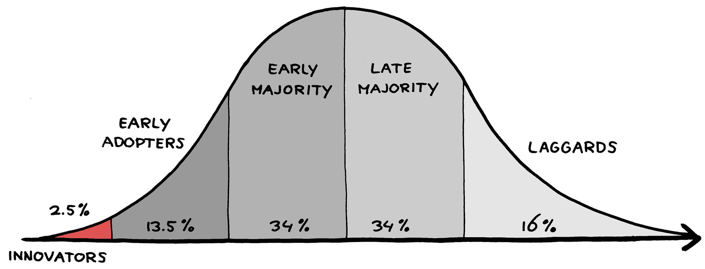

---

# "production ready"
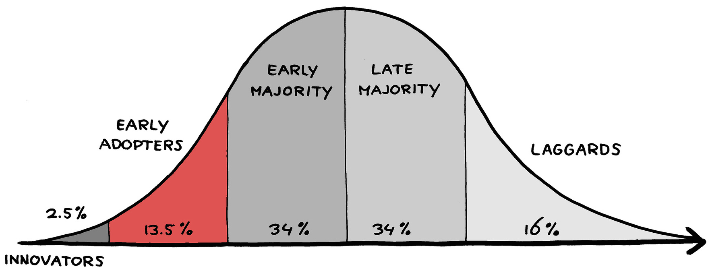

---

# "a cure for what ails yeah"
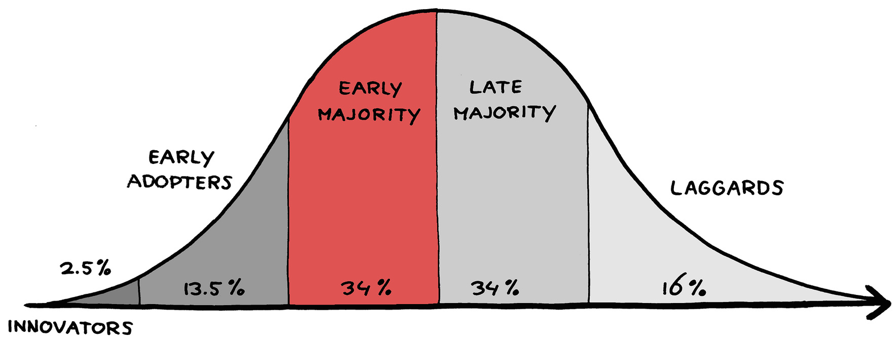

---

# "deprecation warning: the end is nigh!"
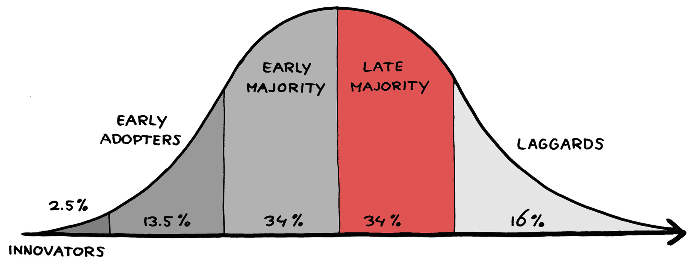

---

# "you are the last to go"
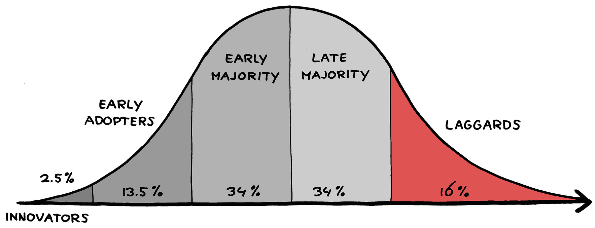

---

# "let's help you finish"
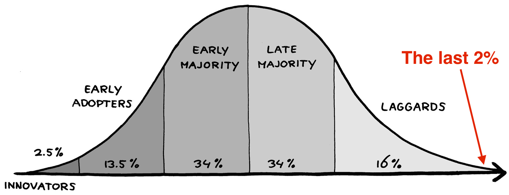

---

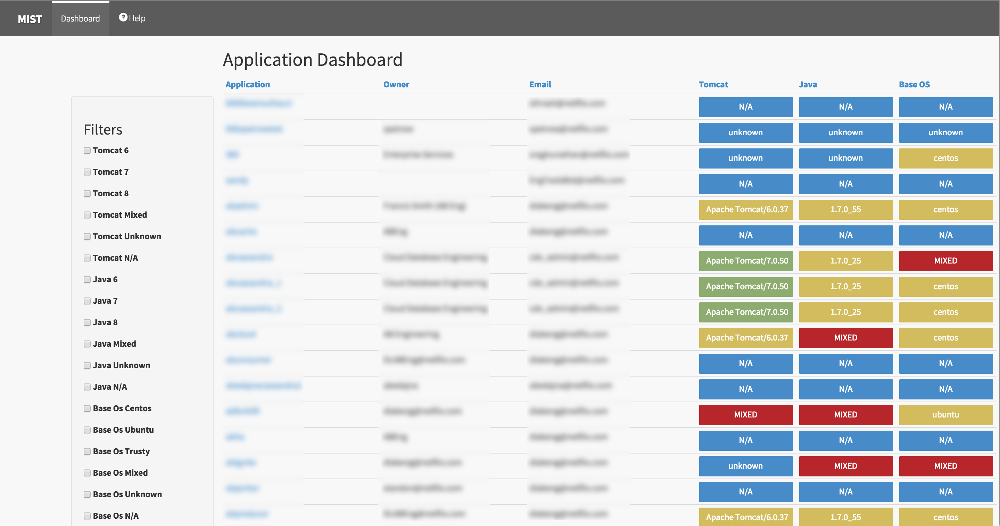

---

# measure change

---

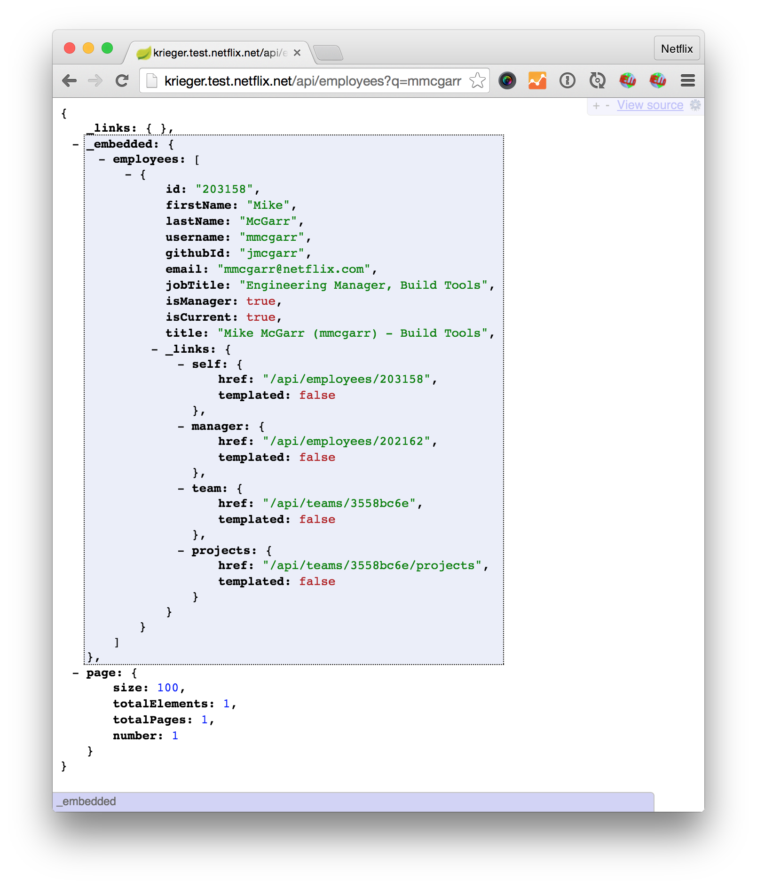
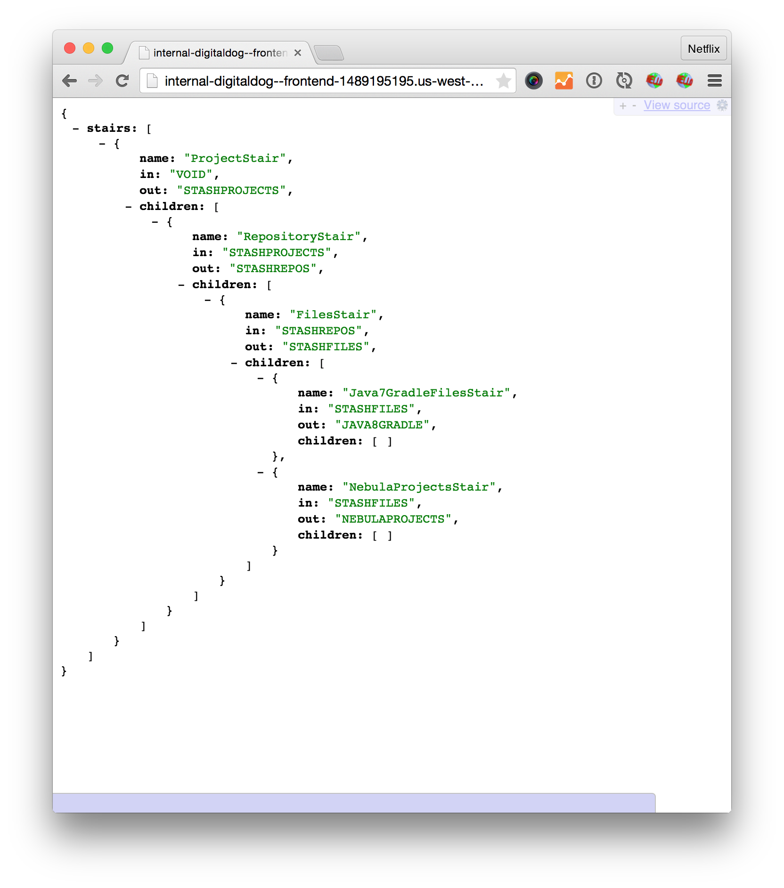

---

# automate change

---

# make continuous change *easy*

---

## understand your *customers*
## develop a customer *support* model
## *innovation* needs time
## make continuous *change* easy

---

# we're *hiring*
### Senior Gradle Engineer - [click to apply](https://jobs.netflix.com/jobs/NFX01905/apply)
### Senior Full Stack Engineer - [click to apply]()
### email me - [mmcgarr@netflix.com](emailto:mmcgarr@netflix.com)
